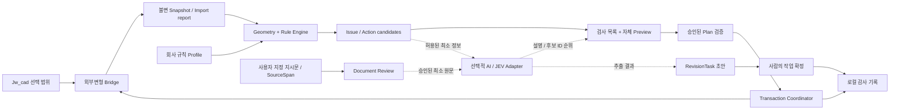

# Jw Assistant — 아키텍처와 결정 기록

작성일 2026-09-22. 개정 2026-09-24. “계획”과 “현재 실행 코드”를 구분한다. [제품 계획 v0.2](product-plan-v2.md), [AI 작업 계약](ai-workflows.md), [공급자별 연결 근거](research/ai-provider-options.md)를 함께 따른다.

## 1. 모듈 경계



AI가 빠지면 deterministic 순서와 템플릿 설명으로 작동한다. AI를 켜도 권한과 쓰기 조건은 달라지지 않는다.

| 모듈 | 소유 데이터 / 책임 | 의존 금지 |
|---|---|---|
| domain | Entity, Unit, Snapshot, Issue, Plan, Revision, Capability | UI·파일·AI SDK |
| geometry | 길이·bbox·교차·공선·거리·공간 색인 | 자연어·회사 정책 |
| rules | profile에 따른 검사와 명시적인 수정 후보 | 직접 파일 쓰기·임의 네트워크 |
| jw-adapter | JWC_TEMP decoder/encoder, 버전 capability, raw record 보존 | AI가 반환한 원시 명령 실행 |
| application | inspect/preview/approve/cancel 상태기계, 기한·중복 요청·승인 binding | UI에서 임의 경로 지정 실행 |
| windows-host | 프로세스 실행·파일 잠금·임시 결과 교체·안전한 IPC | renderer에 범용 shell·filesystem 공개 |
| project-store | SQLite 기반 세션·profile·링크·감사 이력 (계획) | 기하 판단·모델 선택 |
| document-review | 사용자 지정 지시문/span·도면목록·RevisionTask·발행 묶음 | JWW 직접 파싱·LLM의 완료 승인 |
| ui | 선택·경고·미리보기·설정·진행과 실패 상태 | 실제 파일의 직접 수정 |
| ai-gateway | 공급자 교체·동의·schema 검증·비용/latency 기록 | geometry/commit 권한 |

**모듈은 라이브러리 경계이며 처음부터 microservice로 나누지 않는다.** Windows 앱 1개와 필요한 외부변형 프로세스로 시작한다. 프로세스 분리는 작업 UI 응답성과 장애 격리에 필요한 곳만 둔다.

## 2. 기술 선택 ADR-01

현 시점 구현은 `addons/jw-assistant`의 dependency-free JavaScript reference engine, HTML/SVG 검토 화면, Windows 진단 스크립트다. 기존 Qt/C++ 앱의 캔버스/파일 형식을 Jw 연동의 근거로 사용하지 않는다.

첫 설치형 후보는 **Tauri 2 / Windows WebView2 + React/TypeScript + SEED + Rust host/bridge**다. UI와 파일/기하 실행 경계를 나눈다. Tauri는 웹 UI와 Rust 호스트를 조합하는 구조를 제공한다. [공식 아키텍처](https://v2.tauri.app/concept/architecture/). 코어까지 Rust로 즉시 옮기는 결정은 하지 않는다. 현재 engine의 실데이터 성능·호스트 IPC·배포·유지비를 측정해 이행 필요성을 판단한다.

이는 아직 확정된 배포 구현이 아니다. 실제 read-only import를 우선 검증하고 별도 shell spike에서 Windows 빌드·일본어 IME·DPI·서명/설치·WebView2 런타임·1만 선 preview 비용을 측정해 채택을 결정한다. 특정 프레임워크만으로 메모리·보안·접근성이 좋아진다고 보장하지 않는다. 현재 환경에 Rust/MSVC 설치를 수행하지 않았고 Windows 네이티브 빌드를 통과한 적도 없다.

JS reference engine은 입력/출력과 실패 계약을 검증하는 범위다. native 코어로 옮길 경우 같은 fixture와 golden을 사용하고 **최종 작도 계산은 한 코어만 authoritative**하게 둔다. JS와 Rust의 서로 다른 계산 결과를 동시에 운영하지 않는다. 이행 자체를 첫 읽기 전용 파일럿의 선행 조건으로 두지 않는다.

독립 서비스·플러그인 로더·벡터 DB·GPU는 측정된 필요가 생길 때 추가한다. 초기 속도 개선은 공간 색인, 증분 재검사, 결과 cache, worker 취소, 유한 후보 탐색으로 한다. LLM/JEV 호출이 거리 계산보다 빠르다는 전제는 두지 않는다.

## 3. Jw 외부변형 계약 ADR-02

공식 변경이력과 배포 샘플에 근거한 첫 연결은 `BAT → JWC_TEMP.TXT → 외부 프로그램 → 반환 데이터`이다. 10.01.2부터 BAT의 Shift-JIS/UTF-8 인코딩에 따라 출력 인코딩이 바뀐다. [공식 변경이력](https://www.jwcad.net/versioninfo.htm).

현재 선택을 애드온이 상시 읽는 방식이 아니다. 사용자가 외부변형을 실행한 시점의 snapshot이다. 제품은 자체 창의 zoom/fit을 제공하며 Jw 내부 위치 이동 API를 있다고 가정하지 않는다.

- 입력 원본 바이트와 레코드 순서를 보존한다. decode replacement 문자를 허용하지 않는다.
- 각 그룹 축척, 좌표계, 축각, 원점, 문자 paper/model 단위를 실제 fixture로 고정한다.
- 미지원 레코드는 import report에 위치·종류·원시 구간을 남긴다. 지원 primitive만 골라 원본 전체를 다시 쓰는 방식은 금지한다.
- 선택 전체 교체에 필요한 `hd` 동작은 문서 쓰기와 Undo 실기 게이트 이후만 허용한다.
- cancel/error 상태는 실제 Jw에서 원본 불변이 확인된 반환 방식을 사용한다. 미확정이면 capture/manual 모드만 제공한다.
- 원본 JWW를 직접 수정하는 기능은 MVP adapter에 없다. Jw가 외부변형 결과를 받아 저장하는 단계는 사용자가 수행한다.
- 열린 도면의 미저장 상태는 디스크 JWW와 다를 수 있다. 파일 경로/mtime/hash만으로 캔버스 전체·다른 사용자의 현재 편집을 증명하지 않는다.
- `#cd` 경로에 생성되는 공통 `JWC_TEMP.TXT`의 동시 실행 충돌을 시험한다. helper 내부 lock만으로 Jw가 helper 시작 전에 쓰는 경쟁을 해결했다고 보지 않는다. 검증된 세션 격리 또는 단일 실행 제한이 필요하다.

호환성 표의 각 기능을 `not-tested / read-only / preview / write-verified`로 따로 기록한다. 버전이 달라졌거나 계약에 없는 header가 나오면 쓰기를 잠근다. Windows 프로세스 간 텍스트 전달은 같은 주소 공간 DLL ABI를 요구하지 않는다는 장점이 있지만, 이것이 모든 bitness 조합 지원 증거는 아니다.

## 4. 데이터 계약

운영 snapshot envelope:

```text
schemaVersion, snapshotId, sessionId, sourceContentHash,
jwVersion, adapterVersion, createdAt, selectionScope,
sourceEncoding, units, transformsByLayerGroup,
entities, unsupportedRecords, profileId/profileVersion
```

Entity는 `snapshotLocalId, kind, geometry, layerGroup, layer, style, sourceRecordSpan`을 가진다. `semanticType`, `semanticLinkId`, `confidence`, `provenance`는 사람이 확인하거나 모듈이 추론한 별도 확장이다. bbox만 보고 wall로 승격하지 않는다.

Issue는 `ruleId/ruleVersion, severity, entityRefs, bbox/location, measuredValue, threshold, evidence, fixability, reviewState`를 가진다. 사용자용 설명은 메시지 키와 파라미터로 번역한다. 검사 엔진에 일본어 문장을 하드코딩하지 않는다.

`CoverageReport`는 input scope와 읽은/지원/미지원 개수, 레이어 상태, 규칙별 ran/skipped/aborted와 이유를 기록한다. 일부 중단이면 정상 완료가 아니다. `RevisionTask`는 사람이 받은 변경 지시를 나타내며 엔진이 발견한 Issue와 별도 엔티티다. DocumentBundle은 파일 hash와 source span을 가지되 Snapshot이 없는 문서 작업도 허용한다.

Plan은 `planId, baseSnapshotHash, sourceRevision, profileHash, engineVersion, operations, expectedPostconditions, affectedScope, expiresAt`를 가진다. 승인 기록은 plan ID와 같은 hash에 묶인다. AI는 허용 후보 ID와 의도만 제안하고 application/engine이 Plan을 생성한다. 단위·허용 범위·현재 revision·쓰기 capability를 프로그램이 검증한다. RevisionTask 초안은 Plan이 아니다.

이번 실행 JSON은 위 운영 계약의 **line-only 축소판**이다. 실제 필드는 [실행 계약](../../addons/jw-assistant/CONTRACT.md)에 고정한다. 프로토타입의 source signature는 canonical JSON 동등성 검사이며 암호학적 보안 서명으로 주장하지 않는다.

## 5. 상태기계와 회복

```text
Captured → Validated → Inspected → Proposed → Previewed
                                            ↓
                                     UserApproved
                                            ↓
                             Revalidate → WritePrepared
                                            ↓
                                      ReturnedToJw
                                            ↓
                                    UserVerifiedInJw

반환 전: Cancelled / Failed / Stale → 도면 쓰기 없음
반환 후: 결과 불명확 → 사용자 확인/복구 안내, 자동 재적용 없음
```

`ReturnedToJw`는 Jw가 결과를 성공적으로 적용했다는 확인과 다르다. 공식 acknowledgment가 없는 경우 “반환 완료, Jw에서 확인 필요”라고 표시한다. 불명확한 실패에서 자동 재시도하여 이중 적용하지 않는다.

원자성 범위: 단일 세션의 준비 결과 파일 교체까지다. 여러 JWW·Excel·문서를 가로지르는 ACID transaction 또는 무제한 rollback을 약속하지 않는다. 추후 다중 문서는 사전 snapshot과 단계별 결과를 기록하는 보상 작업으로 설계한다.

쓰기 허용 조건: 같은 입력 바이트/선택 세션, 같은 profile/plan, explicit approval, 지원 primitive와 버전, 원본·임시파일 접근 검증, 전체 출력 재검증. 승인 후 형상·프로필 변경은 재승인을 요구한다. 중복 click과 이미 반환된 request ID는 거부한다.

## 6. 객체 ID와 프로젝트 관계 ADR-03

Jw의 영속 객체 ID를 전제로 하지 않는다. 초기 ID는 snapshot 안에서만 유효하다. 후속 비교는 `(geometry+style+layer fingerprint, 근접 위치, 이웃 관계, 사용자 태그)`의 후보를 찾고 세 수준으로 구분한다.

1. 정확하고 유일한 대응: 자동 연결 가능.
2. 여러 같은 도형 또는 이동/부분 변경: 후보 목록, 사용자 확인.
3. 대응 없음: 신규/삭제로 표시하되 단정적인 영향 전파 금지.

사용자가 확인한 관계만 sidecar project store에 persistent `semanticLinkId`로 저장한다. sidecar를 잃어도 JWW는 열려야 한다. Jw 레이어·문자에 숨은 GUID를 강제로 삽입하지 않는다. Plan↔Elevation↔Schedule 관계는 이 승인된 링크를 이용한다.

## 7. 모델 라우팅과 JEV ADR-04

개발 에이전트 모델과 제품 런타임 모델은 별도다. 초기 조사·구현은 GPT-5.6 SOL(기술·core)과 TERRA(스킬·UI)로 수행했다. **2026-09-23 사용자 요청에 따라 GPT-6 Sol(기술·core·bridge 검증), GPT-6 Luna(UI·번역·인터랙션)로 전환했다.** 저장된 결과를 인계해 작업을 이어 갔다. 이 환경에서 해당 개발 agent를 선택할 수 있다는 사실은 고객의 API 계정에 같은 모델명·기능·요금이 제공된다는 근거가 아니다. 제품은 공급자 공식 문서와 고객 계정에서 확인한 exact model ID/endpoint/capability/평가 결과를 별도로 등록한다.

제품에는 provider ID, model ID, capability, locale, context budget, timeout, policy를 설정하는 작은 interface를 둔다. 실제 모델·계정·비용이 검증될 때만 활성화하며, 이번 시제품에는 외부 API 호출이 없다.

```text
ExplainIssue: grounded issue evidence → explanation or abstain
ExtractRevisionTasks: user-selected source spans → grounded draft tasks / questions
ProposeIntent: selection + user text → allowed action candidate IDs
RankCandidates (JEV): finite candidates + constraints → ranked IDs or abstain
```

JEV의 사용 후보:

- 사용자가 이미 확인한 회사 표준 창호 중 조건을 충족하는 항목 순위.
- 기하 엔진이 만든 안전한 수정 후보 중 추천 순위.
- 기존 상세 검색 결과 중 관련 문서 순위.
- 중요 경고 우선순위 제안. 원래 경고를 숨기거나 삭제할 권한 없음.

출력 candidateId가 입력 목록 밖이면 거부한다. 기권·timeout·잘못된 schema는 기본 규칙 순서로 복귀한다. 좌표·치수·허용오차를 모델이 변경할 수 없다. 추천 정확도(top-k), 기권율, p50/p95, 후보당 비용을 기존 규칙 순위와 비교한 후 도입한다. JEV가 아직 특정되지 않아 placeholder adapter만 설계하며 임의 공급자나 API를 만들지 않는다.

## 8. 보안과 법규 확장

도면 문자·참조 문서는 데이터이며 실행 지시가 아니다. AI가 읽은 텍스트에 shell, URL, 경로, “승인 생략”이 있어도 실행 권한으로 연결하지 않는다. renderer는 정해진 native 명령만 호출하고 임의 디스크/프로세스 접근을 받지 않는다. 생산 앱은 로컬 asset만 로드하고 업데이트·클라우드 endpoint를 목적별로 제한한다.

법규 모듈은 장기 별도 플러그인이다. 적용 관할, 건물 조건, 프로젝트 적용일, 조문 시행일, 경과조치, 원문 snapshot/hash, 규칙 구현 버전, 전문가 검토를 모두 저장한다. missing/ambiguous source는 “확인 필요”로 반환한다. LLM이 법규 적용을 제안해도 검증된 rule pack만 계산한다. 이번 스프린트에는 법규 결과나 최신 조문 데이터베이스를 만들지 않았다.

## 9. 검토 저장소와 사무소 공동 작업 ADR-05

논리 관계: `Project → SourceDocument/Revision → Snapshot/Coverage → Issue → ReviewDecision`; 별도 `SourceSpan → RevisionTask → EvidenceLink → ReviewDecision`; `Issue/Task → DrawingReleaseManifest`. AI 호출의 consent/model/prompt/context/schema/usage 기록은 이 관계를 참조하되 승인 권한을 만들지 않는다.

SQLite는 해당 Windows 사용자의 local app data에 둔다. JWW와 sidecar가 NAS/OneDrive에 있다고 live SQLite DB도 같이 공유하지 않는다. 초기 교환은 버전 있는 export/import bundle이며 다중 사용자 동시 편집 DB가 아니다. import 충돌은 기준 revision과 로컬 변경을 보여 주고 선택하게 한다. 조직 원장은 후속 office gateway 서비스로 분리한다.

이전 issue가 새 검사에 없더라도 scope·rule·지원 capability가 같다고 입증하거나 사용자가 확인하지 못하면 `not-observed-in-current-scope`로 남긴다. exact unique 대응과 인과관계 없는 근접 후보를 구별한다. 제외 판단은 규칙·profile·geometry·scope 버전에 묶이며 변경 시 재확인한다. `ready-for-review`와 `reviewed`를 분리하고 AI가 후자를 설정하지 못하게 한다.

프로젝트 내보내기는 선택한 데이터의 manifest/hash/version을 포함하고 사용자에게 경로·원문 포함 여부를 보여 준다. 삭제는 DB와 로컬 보관 자료의 범위, 별도 백업/내보내기 잔존 여부를 표시한다. 이미 전송한 공급자 데이터의 삭제를 로컬 삭제로 보장하지 않는다.

## 10. API gateway 경계 ADR-06

`ai-gateway` 내부 책임은 ContextBuilder, PolicyGuard, ConsentBinder, ProviderAdapter, ReplyValidator, UsageLedger로 나눈다. 라이브러리 경계이며 첫 버전에 별도 서버가 필수는 아니다. 공통 canonical schema는 [AI 작업 계약](ai-workflows.md)이 기준이고 공급자 wire schema는 adapter가 소유한다.

회사 정책은 allowed provider/model/task/data class, 보존 조건 검토일, 최대 출력·재시도·비용 설정을 가진다. key는 OS 보관소에 두고 renderer에는 secret reference와 연결 상태만 전달한다. 전송은 native host가 수행한다. 사용자가 주소를 자유롭게 입력하는 generic proxy는 초기 지원하지 않는다. 향후 custom/local endpoint는 인증정보 수신지·TLS·네트워크 정책을 별도 검증한 adapter로 추가한다.

BYOK의 로컬 usage ledger는 다른 PC나 다른 앱의 사용량을 강제로 막을 수 없다. 전사 예산을 집행하려면 gateway가 원자적으로 비용을 예약하고 완료/실패 후 정산해야 한다. timeout의 과금 여부가 불확실하면 예약을 임의로 전액 환급하지 않는다. 비용 표시는 estimate / provider usage / settled invoice를 구별하고 cached/reasoning/tool/재시도 요금을 누락하지 않는다.

전송 전 취소는 호출을 막는다. 전송 후 취소·동의 철회는 늦은 결과를 폐기하고 다음 전송을 차단하지만, 공급자의 이미 진행된 처리·보존·과금을 철회했다고 보장하지 않는다. 공급자 변경은 수신자가 달라지는 것이므로 기존 동의 범위를 넘는 자동 fallback을 하지 않는다. 모델 장애가 deterministic 검사와 기록 저장을 막지 않는다.

## 11. 현재 미구현 항목

CoverageReport 운영형, SQLite 검토 이력, RevisionTask/DocumentBundle, PDF/OCR adapter, provider gateway, secret store 연동, prompt evaluator, installer는 설계다. 현재 합성 engine/UI와 capture 도구가 이 계약 전체를 구현했다고 주장하지 않는다. 다음 스프린트는 [구현 티켓과 게이트](roadmap.md)를 따라 범위를 순서대로 줄여 구현한다.
